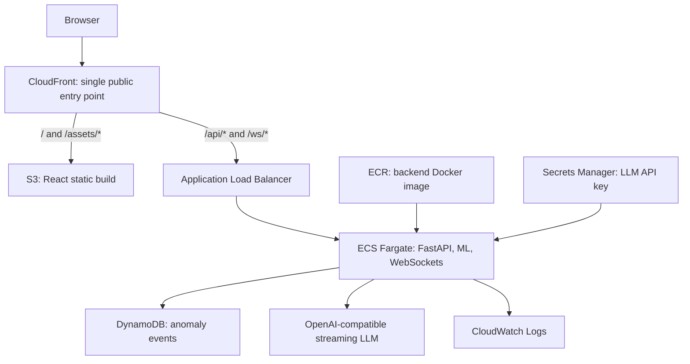

# PulseGuard AI

Real-Time Wearable Health Intelligence Dashboard for a hackathon demonstration. **PulseGuard AI is a demonstration project and does not provide medical diagnosis or medical advice.**

## Features

- Smooth shared wearable simulation: heart rate, SpO2, and 3-axis movement
- FastAPI WebSocket stream with multi-client-safe broadcasting
- Isolation Forest anomaly detection and cooldown
- SQLite anomaly history and deterministic demo trigger
- Token-by-token mock or OpenAI-compatible LLM insights
- React dashboard with bounded live charts, alerts, reconnecting status, and persisted history

## AWS deployment architecture

PulseGuard AI is designed for the following AWS architecture:



The frontend derives API and WebSocket URLs from the current browser origin in production, so CloudFront routes `/api/*` and `/ws/*` through the same public hostname. The backend is container-ready, supports DynamoDB and streaming LLM provider abstractions, and GitHub Actions can build and push the backend image to ECR.

### Current deployment status

The application is **AWS-ready but not yet deployed to AWS**. No ECS service, ALB, CloudFront distribution, S3 bucket, DynamoDB table, or Secrets Manager value has been provisioned through this project yet. The GitHub Actions workflow currently performs only **GitHub → Docker build → ECR push**; it does not deploy to ECS.

## Run locally

```powershell
cd backend
python -m venv .venv
.\.venv\Scripts\Activate.ps1
pip install -r requirements.txt
uvicorn app.main:app --reload
```

In another terminal:

```powershell
cd frontend
npm install
npm run dev
```

`frontend/.env.development` supplies safe local URLs. For any other environment, copy `frontend/.env.example` and set `VITE_API_BASE_URL` and `VITE_WS_URL` at build time.

Open `http://localhost:5173`. Trigger an immediately demonstrable abnormal sequence with `POST http://localhost:8000/api/demo/trigger-anomaly` (for example via FastAPI `/docs`). The anomaly, live insight chunks, and event history should follow.

## APIs

`GET /health`, `GET /api/status`, `GET /api/events`, `GET /api/events/{event_id}`, `POST /api/demo/trigger-anomaly`, and `ws://localhost:8000/ws/live`.

See [architecture documentation](docs/architecture.md), [event protocol](docs/websocket-events.md), [ML details](docs/ml-anomaly-detection.md), and [walkthrough notes](docs/walkthrough-notes.md).

For a complete technical walkthrough and demonstration script, see the [project demo guide](docs/project-demo-guide.md).

For AWS prerequisites, service responsibilities, and scaling boundaries, see [AWS deployment readiness](docs/aws-deployment.md).

## Optional Docker run

After local setup has been verified, run `docker compose up --build` from this directory. This is a local convenience setup only; it is not production deployment infrastructure.
