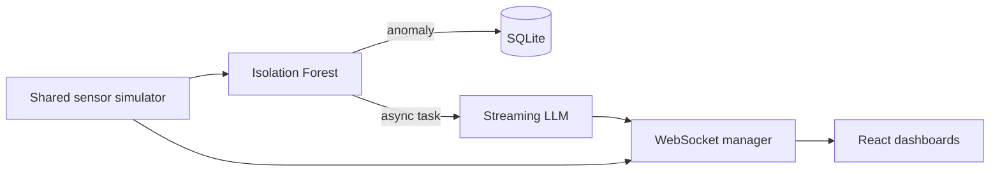

# Architecture

PulseGuard uses one application-wide `sensor_loop`, not one simulator per browser. Each second it creates a reading, broadcasts it, then evaluates it with the in-memory Isolation Forest. An anomaly is persisted and its insight generation is launched with `asyncio.create_task`, so the sensor loop never waits for LLM output. The connection manager broadcasts independently and removes failed sockets.

The in-memory connection manager is deliberately local-only. A horizontally scaled deployment would replace it with shared messaging such as Redis Pub/Sub.
