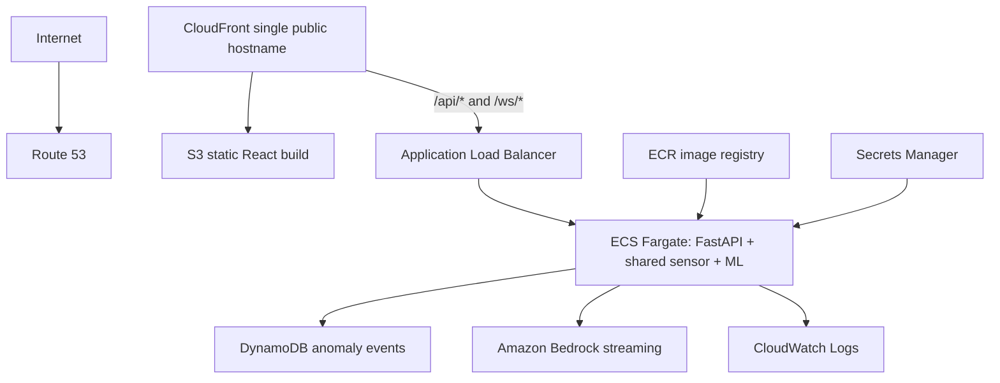

# AWS deployment readiness

This document describes the intended AWS architecture only. No AWS resources, IaC, credentials, or deployment commands are included or executed.

## Target architecture

## Current local versus target AWS configuration

| Concern | Local default | Target AWS |
|---|---|---|
| Event repository | `sqlite` | `dynamodb` |
| LLM provider | `mock` | `bedrock` |
| Frontend | Vite localhost | S3 behind CloudFront |
| Backend | Uvicorn localhost | ECS Fargate through CloudFront and ALB |
| Persistence | SQLite file | DynamoDB |

Configuration controls selection: `EVENT_DATABASE_PROVIDER`, `LLM_PROVIDER`, `AWS_REGION`, `DYNAMODB_TABLE_NAME`, `BEDROCK_MODEL_ID`, `CORS_ALLOWED_ORIGINS`, `VITE_API_BASE_URL`, and `VITE_WS_URL`. Local use never requires AWS credentials.

## Application compatibility

The event workflow depends on `EventRepository`, not a database implementation. SQLite is the default; `DynamoDBEventRepository` supports put, get by `event_id`, recent-event listing, and final-insight updates. The DynamoDB table must already exist: partition key `event_id` (string), with `timestamp`, sensor metrics, scores, severity, `llm_insight`, `created_at`, and `updated_at`. A timestamp GSI may be added later for efficient cross-event recent-history queries; the prototype uses a bounded scan.

LLM providers expose `stream_insight()`. Mock and OpenAI-compatible providers are async; the Bedrock provider runs its blocking SDK stream in a worker thread and forwards chunks to the asyncio loop immediately. This keeps sensor broadcasts responsive. ECS task IAM credentials are discovered by the AWS SDK—no access keys are stored in code.

## Single CloudFront public entry point

The hackathon deployment uses the CloudFront-generated HTTPS hostname as the only public browser origin. CloudFront routes `/` and `/assets/*` to S3, while `/api/*`, `/ws/*`, `/health`, and `/ready` use an ALB origin that reaches ECS. Therefore a browser loaded from `https://<cloudfront-domain>` calls `https://<cloudfront-domain>/api/events` and `wss://<cloudfront-domain>/ws/live`.

The React runtime configuration uses explicit `VITE_API_BASE_URL` and `VITE_WS_URL` values for local development. When those values are absent, it derives the REST base from `window.location.origin` and selects `wss:` for an HTTPS page (or `ws:` for HTTP), using the current host. No CloudFront hostname or future custom domain is compiled into source, so the same static build remains valid if a custom domain is added later.

## ECS, ALB, and WebSockets

The backend Docker image is stateless except for selected persistence, runs as a non-root user, logs to stdout, listens on `0.0.0.0:8000`, and cancels its shared sensor task on shutdown. Configure an ALB target-group health check for `GET /health`; it only checks process liveness. `GET /ready` reports model, simulator, and repository initialization. Bedrock availability is intentionally not part of `/health`.

The ALB accepts REST and WebSocket upgrade requests from CloudFront. CORS is still environment-driven because local Vite and FastAPI use different origins; normal production browser traffic is same-origin through CloudFront. The frontend has no runtime Node requirement: `npm run build` produces static files for S3.

For the initial deployment, ECS desired task count is **one**. That one task owns one in-memory connection manager and sensor stream. With multiple tasks, ALB distributes sockets and in-memory managers cannot broadcast to one another; Redis/ElastiCache Pub/Sub (or equivalent) will be required later. It is intentionally not implemented now.

## AWS service responsibilities

- **S3 + CloudFront:** host and cache static React assets; configure SPA fallback if routing is added.
- **ECR + ECS Fargate:** store and run the backend image. Build, tag, push, then reference the ECR image in a task definition later.
- **DynamoDB:** production anomaly history; no tables are auto-created by the application.
- **Bedrock:** streamed model inference through the ECS task role.
- **Secrets Manager:** inject external OpenAI-compatible secrets through an ECS task definition when required. Bedrock needs IAM, not an API key.
- **CloudWatch Logs:** receive container stdout/stderr through the ECS execution role.
- **Route 53 + ACM:** optional future custom-domain support. The initial CloudFront-generated hostname requires no purchased domain.

## IAM and networking

Keep roles separate. The **task execution role** pulls from ECR, writes CloudWatch logs, and retrieves configured secrets. The **task role** grants only needed DynamoDB item operations, Bedrock model invocation, and Secrets Manager reads where applicable—never AdministratorAccess.

Use an ALB in public subnets across two AZs and ECS tasks in private subnets across two AZs. The ALB security group accepts internet HTTPS (443) and reaches the ECS security group on port 8000. The ECS security group accepts port 8000 only from the ALB group; task ports are never public.

## Deployment boundary

This project is AWS-ready, not AWS-deployed. Infrastructure provisioning, certificate creation, DNS, IAM policies, Secrets Manager values, and ECR/ECS actions are intentionally deferred.
